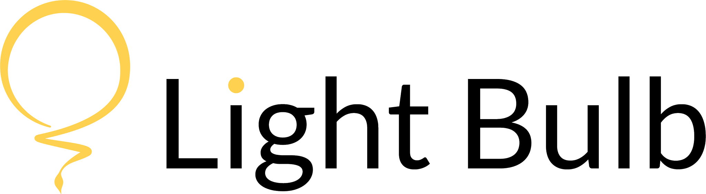

<p align="center">
  <br>
  
  <br>
  <br>
</p>

Light Bulb it's a web application developed during the curricular unit "Web Programming I", inserted into the Web Information Systems and Technologies degree of the Polytechnic of Porto, Portugal.

With Light Bulb we intended to create a friendly and challenging platform where the school community could post questions and answers related to their curricular units. Light Bulb turns school queries into a game by introducing some competition between users and creating achievements for the players.


## Organization

node_modules (contains dependencies to build our project)

public (contains public assets)
      -- index.html
      -- favicon.ico
   
src
      -- assets
      -- components
      -- views
      -- App.vue
      -- main.js
      -- router.js (paths)
      -- store.js
```


## Getting Started

These instructions will get you a copy of the project up and running on your local machine for development and testing purposes.

### Prerequisites

* node.js
* npm
* Vue
* Vue CLI 3
* Vue Router
* VueX
* SweetAlert2
* Bootstrap Vue

### Project setup
```
npm install
```

#### Compiles and hot-reloads for development
```
npm run serve
```

#### Compiles and minifies for production
```
npm run build
```

#### Run your tests
```
npm run test
```

#### Lints and fixes files
```
npm run lint
```

#### Customize configuration
See [Configuration Reference](https://cli.vuejs.org/config/).


## Built With

* [Vue.js](https://vuejs.org/) - JavaScript framework
* [Vue CLI 3](https://cli.vuejs.org/) - Vue Command Line Interface
* [Vue Router](https://router.vuejs.org/) - Routing Library
* [VueX](https://vuex.vuejs.org/) - State Management Pattern


## Author

* **Mariana Moreira**
* **Inês Moreira**
